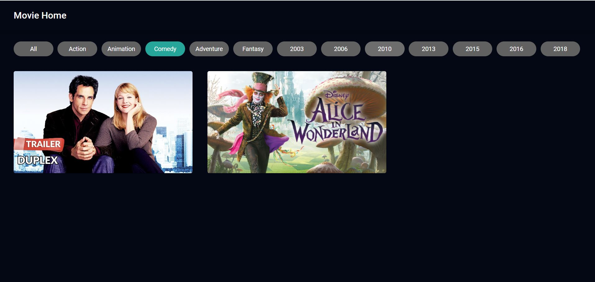
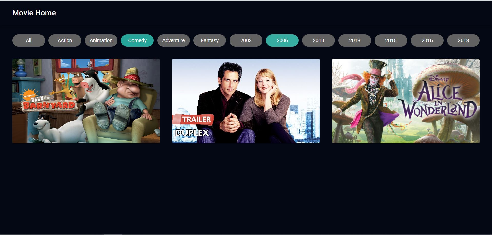
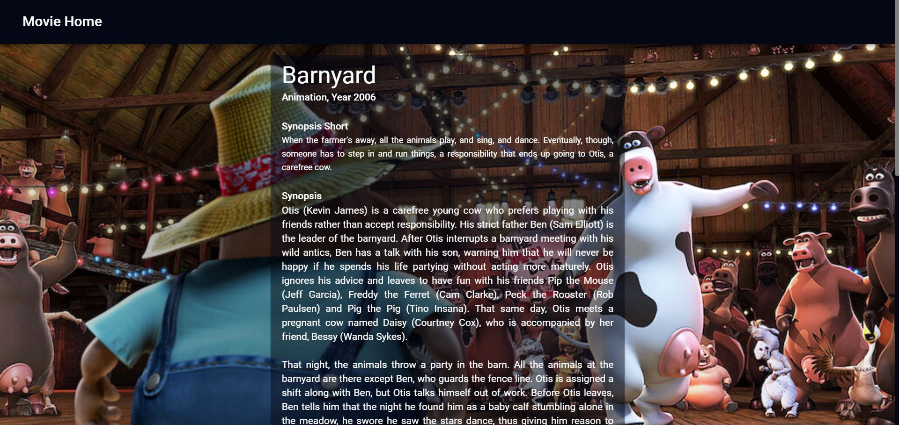
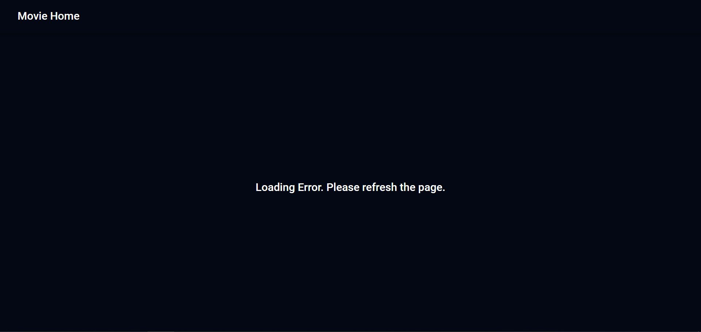
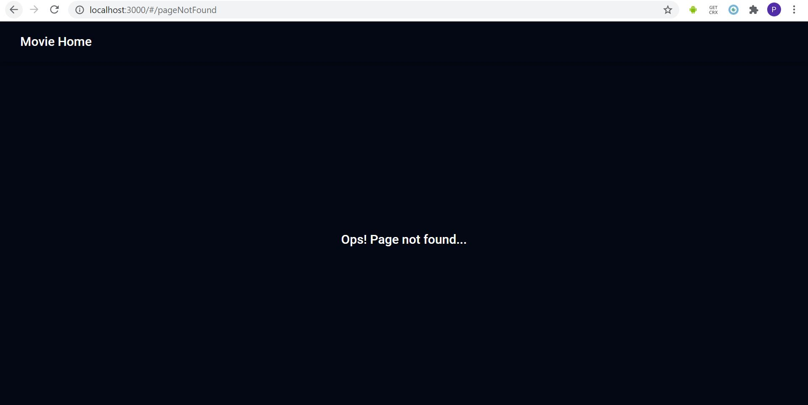
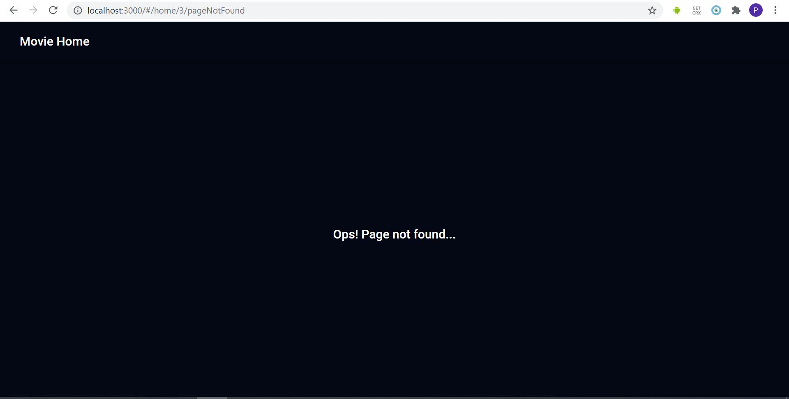
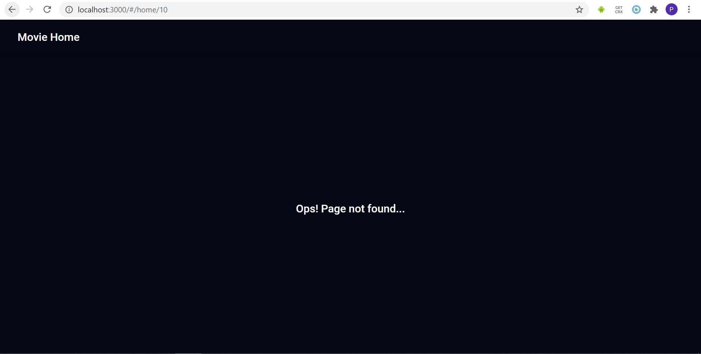

# Movie Web Application

## Installation Guide

1. bash at the root folder
2. command: "npm install" to install the packages in package.json
3. (optional) command: "npm run lint-fix" to fix all "CLRF" to "LF"
4. command: "npm start" to start the application
5. application is accessible at http://localhost:3000/#/

## Main Page Features

1. Main page would display grid of movies and movie details would display when clicked

2. The movies could be filter by (1) genre and (2) production year

- Filter by "Comedy", movies: (Comedy) Duplex and Alice in the Wonderland
  

- Filter by "Comedy" and "2006", movies: (Comedy) Duplex and Alice in the Wonderland or (2006) Barnyard would display
  

## Movie Details Features

1. Movie details page would display the selected movie (from main page)

## General Features

1. When "Movie Home" is clicked, the ui would display home page. Accessible in both main and movie deatails pages.

2. Loading: When data is fetching, the ui will display the loading component

3. Error: when there are error in fetching the data, the ui will display error component

4. Page Not Found: When the page is not found, ui will display not_found component

- e.g. http://localhost:3000/#/pageNotFound, as there are no such routes
  

- e.g. http://localhost:3000/#/1/pageNotFound, as there are no such routes
  

- e.g. http://localhost:3000/#/10 as there are no such movie in the returned data
  
